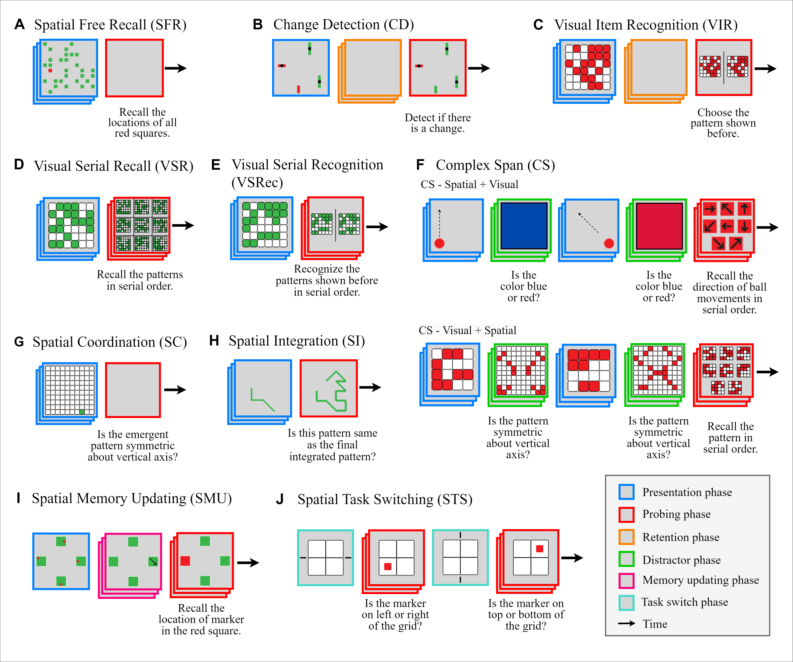

# Decoding the Enigma: Benchmarking Humans and AIs on the Many Facets of Working Memory

Authors: Ankur Sikarwar and Mengmi Zhang

<p align="left">
  <a href="https://arxiv.org/abs/2307.10768.pdf"></a>
</p>

Working memory (WM), a fundamental cognitive process facilitating the temporary storage, integration, manipulation, and retrieval of information, plays a vital role in reasoning and decision-making tasks. Robust benchmark datasets that capture the multifaceted nature of WM are crucial for the effective development and evaluation of AI WM models. Here, we introduce a comprehensive Working Memory (WorM) benchmark dataset for this purpose. WorM comprises 10 tasks and a total of 1 million trials, assessing 4 functionalities, 3 domains, and 11 behavioral and neural characteristics of WM.

## WorM Dataset

Download the WorM dataset from [HERE](https://drive.google.com/file/d/1-KU74RUE98GIYtZeG6GW2y6cjEzCxVC1/view?usp=sharing)
Extract the dataset to ```WorM/wm_bench_data/```

```wm_bench_data``` contains raw stimulus and metadata for all trials for all working memory (WM) tasks.

Data generation code for all WM tasks can be found in ```src/data/``` and PyTorch `Dataset` for each task can be found in ```src/data/dataset.py```

### Dependencies

- tested with python 3.8 and cuda 11.3
- dependencies can be installed using `WorM/requirements.txt`

## Joint Training and Testing

After extracting the WorM dataset, run the following command from ```WorM/``` directory to jointly train and test on all working memory (WM) tasks.

```python -m src.main```

Refer to ```src/args.py``` for possible arguments.

## Schematic Illustration of all Working Memory tasks

<br>
<p align="center">
</p>
